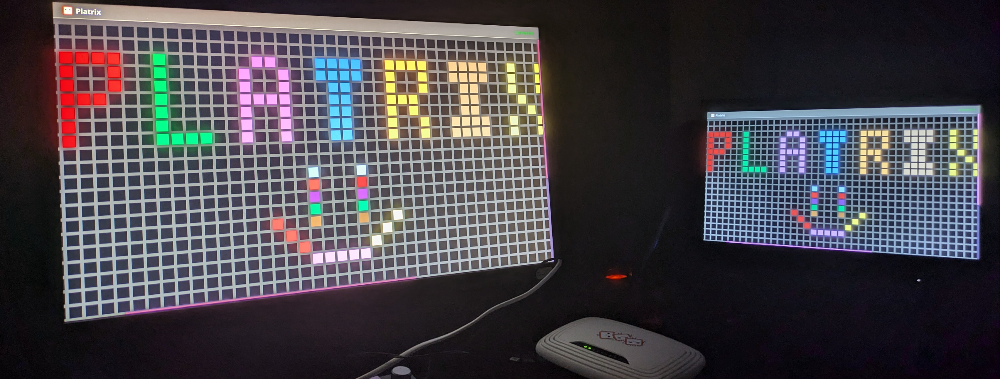

# Platrix!

Inspired by r/place. Allows users to manipulate pixel colors on LED matrices in real time. The system supports commands to retrieve the current state of the matrix and set individual pixel colors. The application is built using ~~ESP32~~ Raspberry Pi with an asynchronous web server and React + TS + Vite frontend.

Made for the [Cover Committee Market 2024](https://svcover.nl/calendar?agenda_id=4557)
